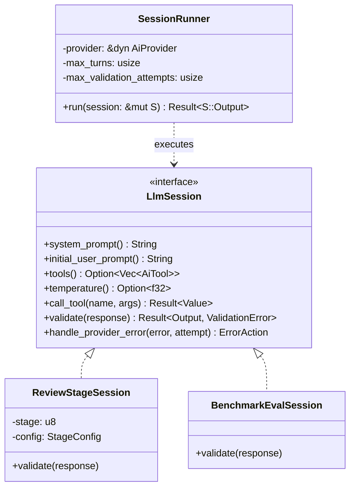

# Design: Modular LLM Sessions

## Objective

Sashiko uses Large Language Models (LLMs) to perform multi-stage reviews and benchmark evaluations. Currently, the orchestrator logic that handles LLM interactions—including managing conversation history, running tool execution loops, validating structured output, and handling retries/fallbacks—is tightly coupled with specific tasks (like `Worker`'s patch review) and duplicated across different files.

The goal of this design is to:
1.  **Unify Agent Execution Loops:** Extract the generic loop of sending requests to LLMs, executing requested tools, and accumulating history into a reusable `SessionRunner`.
2.  **Define a Clean Task Contract:** Create a `LlmSession` trait that encapsulates task-specific details (prompts, available tools, output validation rules, and error handling behaviors).
3.  **Deduplicate Validation Logic:** Clean up the disparate verification loops inside the multi-stage reviewer (Stages 1-7, 8, 9, 10, 11) and the benchmark evaluator.
4.  **Enhance Robustness:** Provide a consistent way to handle formatting errors (with feedback loops) and recitation blocks across all stages.

## Current Architecture & Pain Points

Currently, AI interactions are split:

1.  **`Worker::run_ai_stage_raw` (in [prompts.rs](file:///usr/local/google/home/kfree/sashiko/src/worker/prompts.rs#L1492))**:
    *   Implements the core loop: sends request to `AiProvider`, executes tools from `ToolBox`, appends results to history, and loops.
    *   Hardcoded to use `ToolBox`.
    *   Does not validate final output format (assumes raw string/JSON is handled by caller).

2.  **`Worker::execute_stage` (Stages 1-7)**:
    *   Calls `run_ai_stage` (which parses JSON).
    *   Validates using `required_stage_arrays`.
    *   Implements an inner/outer retry loop. If validation fails, it appends a reminder to the prompt and retries.

3.  **Stages 8, 9, 10**:
    *   Call `run_ai_stage` directly.
    *   Manually validate JSON array structures but **lack retry-on-failure** logic. If the LLM generates invalid JSON, the stage fails immediately.

4.  **Stage 11**:
    *   Calls `run_ai_stage_raw` directly.
    *   Implements its own retry-on-format-failure loop (`validate_inline_format`).
    *   Implements its own fallback logic for RECITATION errors (switching to `free_form_mode`).

5.  **`benchmark.rs`**:
    *   Manually constructs `AiRequest`, calls `client.generate_content`, and implements its own loop to handle transient errors.

This results in fragmented error handling, inconsistent validation retry mechanisms, and tight coupling of the agent loop with the patch review logic, making it hard to add new agentic workflows.

## Proposed Architecture

We will introduce a generic `LlmSession` trait and a `SessionRunner` struct.



### 1. The `LlmSession` Trait

Defines the configuration, behavior, and validation rules for an individual task.

```rust
use async_trait::async_trait;
use serde_json::Value;
use crate::ai::{AiResponse, AiTool, AiResponseFormat};

/// Result of validating a session's final response.
pub enum ValidationError<T> {
    /// The response is valid. Contains the parsed output.
    Success(T),
    /// The response was invalid but can be retried.
    /// Contains a feedback message to append to the LLM prompt.
    FormatViolation(String),
    /// A fatal error that cannot be resolved by retrying.
    Fatal(String),
}

pub enum ErrorAction {
    /// Retry the request after appending the feedback message to the prompt history.
    RetryWithFeedback(String),
    /// Abort the session immediately.
    Fail,
}

#[async_trait]
pub trait LlmSession {
    /// The final output type returned by the session after validation.
    type Output: Send;

    /// The system prompt.
    fn system_prompt(&self) -> String;

    /// The initial user prompt.
    fn initial_user_prompt(&self) -> String;

    /// Optional list of tools available in this session.
    fn tools(&self) -> Option<Vec<AiTool>> { None }

    /// Optional temperature override.
    fn temperature(&self) -> Option<f32> { None }

    /// Optional context tag for logging.
    fn context_tag(&self) -> Option<String> { None }

    /// Optional expected response format.
    fn response_format(&self) -> Option<AiResponseFormat> { None }

    /// Executes a tool call requested by the LLM.
    async fn call_tool(&mut self, _name: &str, _args: Value) -> Result<Value, anyhow::Error> {
        anyhow::bail!("Tools not supported in this session")
    }

    /// Validates the final response content.
    fn validate(&mut self, response: &AiResponse) -> Result<Self::Output, ValidationError<Self::Output>>;

    /// Hook to handle provider errors (e.g. safety blocks, rate limits).
    fn handle_provider_error(&mut self, error: &anyhow::Error, _attempt: usize) -> ErrorAction {
        let err_str = error.to_string();
        if err_str.contains("RECITATION") || err_str.contains("blocked") {
            ErrorAction::RetryWithFeedback(
                "IMPORTANT: Your previous response was blocked by a recitation filter. \
                 Please do NOT copy large blocks of code verbatim in your response. \
                 Describe changes in prose, or use highly simplified pseudo-code."
                    .to_string(),
            )
        } else {
            ErrorAction::Fail
        }
    }
}
```

### 2. The `SessionRunner`

Orchestrates the execution of a `LlmSession`. It handles the loops, history management, and retries.

```rust
use crate::ai::{AiProvider, AiRequest, AiMessage, AiRole};

pub struct SessionRunner<'a> {
    provider: &'a dyn AiProvider,
    max_turns: usize,
    max_validation_attempts: usize,
}

impl<'a> SessionRunner<'a> {
    pub fn new(provider: &'a dyn AiProvider) -> Self {
        Self {
            provider,
            max_turns: 15,
            max_validation_attempts: 3,
        }
    }

    /// Configures the maximum validation retries.
    pub fn with_max_validation_attempts(mut self, attempts: usize) -> Self {
        self.max_validation_attempts = attempts;
        self
    }

    /// Runs the session to completion. Returns the validated output and full message history.
    pub async fn run<S>(&self, session: &mut S) -> Result<(S::Output, Vec<AiMessage>), anyhow::Error>
    where
        S: LlmSession,
    {
        let mut history = vec![AiMessage {
            role: AiRole::User,
            content: Some(session.initial_user_prompt()),
            thought: None,
            thought_signature: None,
            tool_calls: None,
            tool_call_id: None,
        }];

        let mut turns = 0;
        let mut validation_attempts = 0;

        loop {
            turns += 1;
            if turns > self.max_turns {
                anyhow::bail!("Session exceeded max turns limit ({})", self.max_turns);
            }

            let request = AiRequest {
                system: Some(session.system_prompt()),
                messages: history.clone(),
                tools: session.tools(),
                temperature: session.temperature(),
                response_format: session.response_format(),
                context_tag: session.context_tag(),
            };

            let resp = match self.provider.generate_content(request).await {
                Ok(r) => r,
                Err(e) => match session.handle_provider_error(&e, validation_attempts) {
                    ErrorAction::RetryWithFeedback(feedback) => {
                        history.push(AiMessage {
                            role: AiRole::User,
                            content: Some(feedback),
                            thought: None,
                            thought_signature: None,
                            tool_calls: None,
                            tool_call_id: None,
                        });
                        continue;
                    }
                    ErrorAction::Fail => return Err(e),
                }
            };

            if resp.truncated {
                anyhow::bail!("LLM output was truncated by provider (e.g. hit max tokens)");
            }

            let assistant_msg = AiMessage {
                role: AiRole::Assistant,
                content: resp.content.clone(),
                thought: resp.thought.clone(),
                thought_signature: resp.thought_signature.clone(),
                tool_calls: resp.tool_calls.clone(),
                tool_call_id: None,
            };
            history.push(assistant_msg);

            // Handle Tool Calls
            if let Some(tool_calls) = &resp.tool_calls {
                for call in tool_calls {
                    let result = session.call_tool(&call.function_name, call.arguments.clone()).await?;
                    history.push(AiMessage {
                        role: AiRole::Tool,
                        content: Some(result.to_string()),
                        thought: None,
                        thought_signature: None,
                        tool_calls: None,
                        tool_call_id: Some(call.id.clone()),
                    });
                }
                continue; // Loop again to feed tool results back to LLM
            }

            // No tool calls: validate response
            match session.validate(&resp) {
                Result::Ok(output) => return Ok((output, history)),
                Result::Err(ValidationError::Success(output)) => return Ok((output, history)),
                Result::Err(ValidationError::FormatViolation(violation)) => {
                    validation_attempts += 1;
                    if validation_attempts >= self.max_validation_attempts {
                        anyhow::bail!(
                            "Failed to generate valid response after {} validation attempts. Last violation: {}",
                            self.max_validation_attempts,
                            violation
                        );
                    }
                    let feedback = format!(
                        "Previous attempt was rejected: {}. Please correct your output format.",
                        violation
                    );
                    history.push(AiMessage {
                        role: AiRole::User,
                        content: Some(feedback),
                        thought: None,
                        thought_signature: None,
                        tool_calls: None,
                        tool_call_id: None,
                    });
                }
                Result::Err(ValidationError::Fatal(err)) => {
                    anyhow::bail!("Fatal validation error: {}", err);
                }
            }
        }
    }
}
```

## Refactoring Plan

We will implement this refactoring step-by-step:

### Step 1: Define core structures in `src/ai/session.rs`
Create a new file `src/ai/session.rs` containing `ValidationError`, `ErrorAction`, `LlmSession` trait, and `SessionRunner`.
Export them in `src/ai/mod.rs`.

### Step 2: Implement `ReviewStageSession` in `src/worker/session.rs`
Create a helper struct `ReviewStageSession` inside a new module `src/worker/session.rs` or directly in `src/worker/prompts.rs`.
This struct will encapsulate:
*   The `stage` number.
*   System and User prompts (retrieved from `PromptRegistry`).
*   Reference to `ToolBox` (for `call_tool`).
*   State tracking for Stage 11 (e.g. `free_form_mode` flag for recitation fallback).
*   Implementation of `LlmSession` with specific validation logic for each stage:
    *   Stages 1-7: uses `required_stage_arrays`.
    *   Stage 8: validates `concerns` and `dismissed_concerns` are arrays.
    *   Stage 9: validates `concerns` is an array.
    *   Stage 10: validates `findings` is an array.
    *   Stage 11: validates LKML report format and handles recitation fallback.

### Step 3: Replace `Worker` execution logic with `SessionRunner`
*   Refactor `Worker::execute_stage` (Stages 1-7) to instantiate `ReviewStageSession` and run it via `SessionRunner`.
*   Refactor Stages 8, 9, 10, 11 inside `Worker::run` to similarly use `ReviewStageSession` and `SessionRunner`, enabling robust retries for Stages 8, 9, and 10 which previously lacked it.
*   Remove `run_ai_stage` and `run_ai_stage_raw` from `Worker`.

### Step 4: Refactor `benchmark.rs`
Create a `BenchmarkEvalSession` in `src/bin/benchmark.rs` implementing `LlmSession`.
*   `system_prompt` -> `None`.
*   `initial_user_prompt` -> evaluation prompt.
*   `validate` -> parses `DETECTED`, `PARTIALLY_DETECTED`, `MISSED` via Regex.
Use `SessionRunner` in `benchmark.rs` to run this evaluation, removing the manual loop.

### Step 5: Verification & Safety
*   Run unit tests: `make test` to ensure basic compilation and parsing tests still pass.
*   Run integration tests: `make integration-test`.
*   Run benchmark verification: Compare `benchmark_results.json` before and after the change on a small run to ensure no regressions in detection rates.

## Regression Prevention

*   **Behavioral Equivalence**: The validation prompts and error feedback strings injected into the LLM context must remain identical or equivalent to the existing logic to ensure LLM behavior is not altered.
*   **Stage History**: The `SessionRunner` will return the conversation history, which is appended to `Worker::global_history` just like before. We must ensure the structure of `global_history` remains exactly the same.
*   **Clippy & Formatting**: Run `make check-pr` before any commit to ensure style guide compliance.
